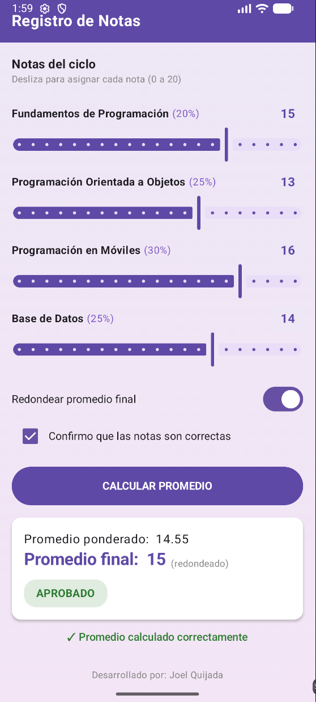

# Laboratorio 03: Registro de Notas

Aplicación móvil desarrollada en Android con Jetpack Compose para el cálculo del promedio ponderado de notas académicas, control de redondeo y asignación de observaciones finales.

---

## Descripción del Proyecto

La aplicación permite registrar las notas de 4 cursos del ciclo mediante controles deslizantes (Slider), aplicar un redondeo opcional al entero más cercano (Switch) y calcular el promedio ponderado únicamente tras la confirmación del usuario (Checkbox).

---

## Tecnologías Utilizadas

- Lenguaje: Kotlin
- Framework: Jetpack Compose (Material Design 3)
- Arquitectura: Componentes de Estado (remember, mutableStateOf, mutableFloatStateOf)
- Control de Versiones: Git y GitHub

---

## Reglas de Negocio Implementadas

### Cursos y Pesos
- Fundamentos de Programación: 20%
- Programación Orientada a Objetos: 25%
- Programación en Móviles: 30%
- Base de Datos: 25%

### Escala de Observaciones
| Promedio Final | Observación | Color del Badge |
| :--- | :--- | :--- |
| **17.0 - 20.0** | EXCELENTE | Verde oscuro |
| **13.0 - 16.99** | APROBADO | Verde |
| **10.0 - 12.99** | EN RECUPERACIÓN | Ámbar |
| **Menor a 10** | DESAPROBADO | Rojo |

---

## Captura de Pantalla

---
