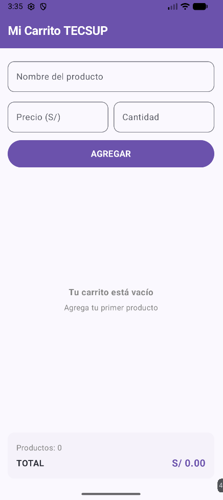
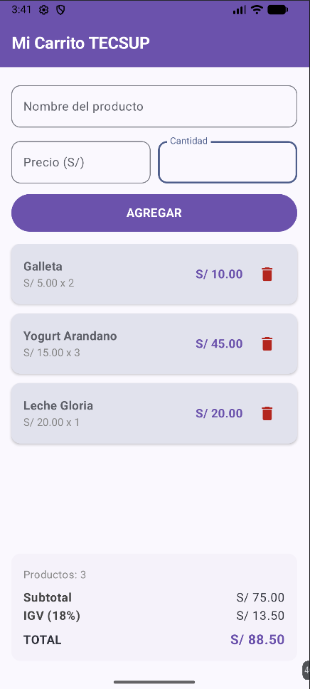

# Lab 04 - Carrito TECSUP

**Estudiante:** Joel Facundo Quijada Zevallos

## Descripción
Aplicación móvil desarrollada en Android con Jetpack Compose que simula un carrito de compras interactivo. Permite agregar productos, visualizar la lista dinámicamente, eliminar productos y calcular en tiempo real el Subtotal, IGV y el Total a pagar.

---

## Capturas de Pantalla

|            Estado Vacío             | Carrito con Productos |
|:---:| :---: |
|||

---

## Preguntas Conceptuales

**a) ¿Por qué `mutableStateListOf` y no una `MutableList` normal?**  
`mutableStateListOf` es un estado observable por Jetpack Compose. Al agregar o eliminar elementos, Compose detecta los cambios y redibuja la interfaz en tiempo real. En cambio, una `MutableList` normal modifica los datos internamente, pero no notifica a la interfaz para que se actualice.

**b) ¿Por qué la lista se declara con `val` y aún así podemos agregarle elementos?**  
`val` garantiza que la referencia al objeto no puede reasignarse a una nueva lista. Sin embargo, la estructura interna de la lista sigue siendo mutable, por lo que se pueden utilizar métodos como `.add()` o `.remove()` para modificar sus elementos.

**c) ¿Qué hace `weight(1f)` en la `LazyColumn`?**  
Indica al contenedor vertical (`Column`) que la `LazyColumn` debe ocupar todo el espacio vertical disponible entre los campos de entrada y el panel de totales. Además, permite que la lista tenga desplazamiento (*scroll*) sin desplazar el panel de totales fuera de la pantalla.