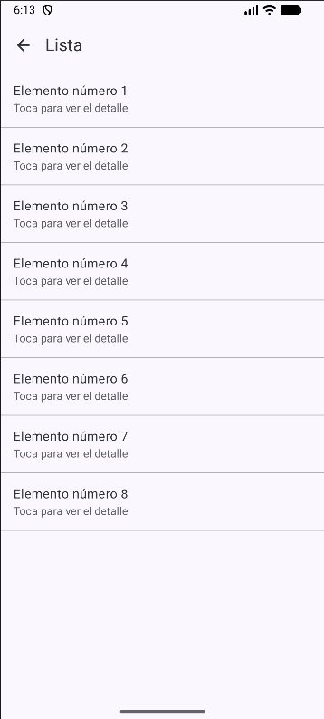

# NavLab — Sistema de Navegación con Jetpack Compose

**Estudiante:** Joel Quijada  
**Rama de trabajo:** `sin-ia`  
**Tecnología principal:** Android Studio / Kotlin / Jetpack Compose Navigation

---

## Descripción del Proyecto

Esta aplicación sirve como demostración práctica del manejo de flujos de pantallas en Android moderno. Implementa una arquitectura de navegación desacoplada utilizando `NavHost`, paso explícito de argumentos fuertemente tipados (IDs numéricos) entre pantallas y control de la pila de historial (*back stack*).

---

## Funcionalidades e Requisitos del Sistema

* **RF-01 (Pantalla Principal):** Punto de acceso inicial con opciones estructuradas para dirigirse al catálogo de componentes o a la vista de perfil de usuario.
* **RF-02 (Listado Dinámico):** Despliegue de colecciones de elementos seleccionables donde el usuario puede interactuar con cualquier ítem para consultar su información individual.
* **RF-03 (Detalle Tipado):** Interfaz parametrizada que recibe e interpreta el identificador único (`ID`) enviado desde la lista a través del `NavHost`, incluyendo navegación de retorno mediante la barra superior.
* **RF-04 (Perfil y Limpieza de Pila):** Sección de perfil que ofrece una vía directa para regresar al menú principal reseteando la pila de navegación previa.

---

## Evidencia Visual de Pantallas

| Inicio | Listado | Detalle de Ítem | Perfil de Usuario |
| :---: | :---: | :---: | :---: |
|  |  |  |  |

---

*Proyecto desarrollado por **Joel Quijada** para la asignatura de Desarrollo de Aplicaciones Móviles.*